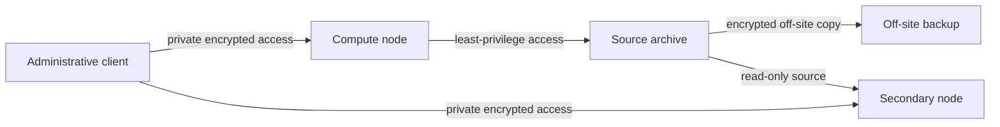

# Home Server Lab — Public Portfolio

This repository is a sanitized, recruiter-facing view of a private home-lab
project. It demonstrates Linux administration, secure remote access,
infrastructure-as-code, storage design, backup verification, change control,
and privacy-conscious technical communication.

The private operational repository is the technical source of truth. This
public projection deliberately omits live hostnames, addresses, usernames,
hardware identifiers, schedules, providers, capacities, private paths,
credentials, raw logs, screenshots, and unresolved security details.

## What the project demonstrates

- Key-based remote administration without public service exposure
- Separate compute, storage, and secondary-protection roles
- Reproducible configuration and pull-request-based change control
- Fail-closed validation for synthetic/public dataset provenance
- A layered backup model that distinguishes availability from recovery
- Disposable restore exercises verified with cryptographic checksums
- Automated checks that prevent common secrets and personal metadata from
  entering the public portfolio
- A strict synthetic-or-public-data boundary: no PHI, patient-derived data,
  employer material, or proprietary clinical-system content

## Generalized architecture

The diagram communicates trust direction and recovery roles without exposing
the live environment. See [architecture notes](docs/architecture.md) for the
design reasoning and [verification evidence](docs/verification-evidence.md)
for the bounded claims this portfolio makes.

## Engineering principles

1. Verify the effective system state; do not infer it from a configuration file.
2. Keep secrets and operational identifiers outside version control.
3. Test recovery with disposable data before describing a backup as recoverable.
4. Use least privilege and one-directional trust between protection layers.
5. Record decisions and evidence without publishing the environment itself.
6. Treat public documentation as a derived view, not a second operational source
   of truth.

## Public-safety boundary

The automated public-safety workflow scans tracked text and new commit metadata
for high-confidence secret and privacy indicators. Automation is a guardrail,
not a substitute for human review. Please report a suspected disclosure using
[SECURITY.md](SECURITY.md).

## License

MIT. See [LICENSE](LICENSE).
